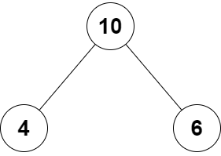

## 2236. Root Equals Sum of Children
      
      You are given the root of a binary tree that consists of exactly 3 nodes: the root, its left child, and its right child.
      
      Return true if the value of the root is equal to the sum of the values of its two children, or false otherwise.

      Example 1



Input: 

            root = [10,4,6]

Output: 

            true

Explanation: 

            The values of the root, its left child, and its right child are 10, 4, and 6, respectively.
            10 is equal to 4 + 6, so we return true.


Input: 

            root = [5,3,1]

Output: 

            false

Explanation: 

            The values of the root, its left child, and its right child are 5, 3, and 1, respectively.
            5 is not equal to 3 + 1, so we return false.

Constraints:

            The tree consists only of the root, its left child, and its right child.
            -100 <= Node.val <= 100

```java

/**
 * Definition for a binary tree node.
 * public class TreeNode {
 *     int val;
 *     TreeNode left;
 *     TreeNode right;
 *     TreeNode() {}
 *     TreeNode(int val) { this.val = val; }
 *     TreeNode(int val, TreeNode left, TreeNode right) {
 *         this.val = val;
 *         this.left = left;
 *         this.right = right;
 *     }
 * }
 */
class Solution {
    public boolean checkTree(TreeNode root) {

        return root.val == (root.left.val + root.right.val);
        
    }
}

```

---

2331. Evaluate Boolean Binary Tree

You are given the root of a full binary tree with the following properties:

Leaf nodes have either the value 0 or 1, where 0 represents False and 1 represents True.
Non-leaf nodes have either the value 2 or 3, where 2 represents the boolean OR and 3 represents the boolean AND.
The evaluation of a node is as follows:

If the node is a leaf node, the evaluation is the value of the node, i.e. True or False.
Otherwise, evaluate the node's two children and apply the boolean operation of its value with the children's evaluations.
Return the boolean result of evaluating the root node.

A full binary tree is a binary tree where each node has either 0 or 2 children.

A leaf node is a node that has zero children.

 

Example 1:


                  Input: root = [2,1,3,null,null,0,1]
                  
                  Output: true
                  
                  Explanation: The above diagram illustrates the evaluation process.
                  The AND node evaluates to False AND True = False.
                  The OR node evaluates to True OR False = True.
                  The root node evaluates to True, so we return true.
                  
Example 2:

            Input: root = [0]

            Output: false
            
            Explanation: The root node is a leaf node and it evaluates to false, so we return false.
 

Constraints:

            The number of nodes in the tree is in the range [1, 1000].
            0 <= Node.val <= 3
            Every node has either 0 or 2 children.
            Leaf nodes have a value of 0 or 1.
            Non-leaf nodes have a value of 2 or 3.


```java


/**
 * Definition for a binary tree node.
 * public class TreeNode {
 *     int val;
 *     TreeNode left;
 *     TreeNode right;
 *     TreeNode() {}
 *     TreeNode(int val) { this.val = val; }
 *     TreeNode(int val, TreeNode left, TreeNode right) {
 *         this.val = val;
 *         this.left = left;
 *         this.right = right;
 *     }
 * }
 */
class Solution {


    
    static boolean inOrder(TreeNode theNode){
        if(theNode == null){
            throw new Error("");
        }

        if(theNode.val == 0 || theNode.val == 1){
            return theNode.val == 1;
        }

        boolean leftVal = inOrder(theNode.left);
        boolean rightVal = inOrder(theNode.right) ;

        if(theNode.val == 2){ // OR case

            return  ( leftVal || rightVal) ;

        }else{  // AND case

            return  ( leftVal &&  rightVal) ;
        }


    }
    public boolean evaluateTree(TreeNode root) {

        return inOrder(root);
   
        
    }
}


// Another Solution: from @gameboey

class Solution {
    public boolean helper(TreeNode root) {
        if(root.val == 0 || root.val == 1) {
            return root.val == 1;
        } else if(root.val == 2) {
            return helper(root.left) || helper(root.right);
        } else if(root.val == 3) {
            return helper(root.left) && helper(root.right);
        } 

        return false;
    }
    public boolean evaluateTree(TreeNode root) {
        return helper(root);
    }
}

```


